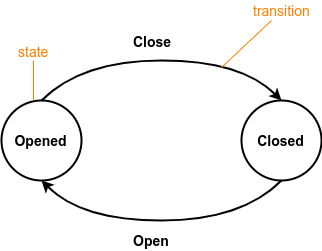

Introduction to objects
=======================

Introduction
------------

In SurgeScript, objects are units of code and data. Each object defines a finite state machine, a mathematical construct used to describe the behavior of in-game objects.

> **Did you know?**
> 
> Games implement what is called a game loop. In SurgeScript, the game loop is defined implicitly via state machines. State machines are one of the key features of SurgeScript.

State machines
--------------

A finite state machine is a mathematical abstraction composed of a finite number of **states** and by **transitions** between these states. Only one state can be active at any given time (we'll call it the **active state**). There must be one **initial state** (i.e., the first one to be active). A transition is a change of the active state that is triggered when a certain condition is met.

As a concrete example, suppose that you want to create a door in your game. You, the developer, may open or close the door at will. But what is a door? We have just given *informal* description of the problem. However, we need to transform it in something more rigorous. Example:

A door is an object with two states (see the Figure below):

- Opened (initial state)
- Closed



From the Opened state, only one transition is possible: Close. Once the Close transition is called, the door will go to the Closed state. Conversely, from the Closed state, only one transition is available: Open. When the Open transition is executed, the door will return to the Opened state.

Objects in SurgeScript
----------------------

In SurgeScript, each object has a name. Objects may have any number of states you'd like. The initial state is always called **main**. The syntax is as follows:

```cs
object "name of the object"
{
    state "state name"
    {
        // code goes here
    }
}
```

The following code shows an example of a door that opens and closes (it keep changing states) every 2 seconds:

```cs
object "Cosmic Door"
{
    state "main"
    {
        // the object starts at the main state
        state = "opened"; // go to the opened state
    }

    state "opened"
    {
        if(timeout(2)) // if we have been on the opened state for 2+ seconds
            state = "closed"; // go to the closed state
    }

    state "closed"
    {
        if(timeout(2))
            state = "opened";
    }
}
```

Notice how the code just shown defines states and transitions between these states. Each state contains its own code.

**Note:** once a state is active, its code will be repeated at every frame of the application until the state changes or until the object is destroyed.
